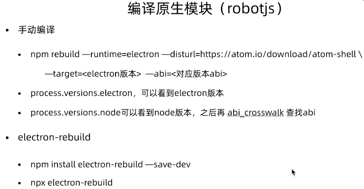

npm install --arch=ia32 --platform=win32 electron
> 指定 arch=ia32 来安装32位的electron，在 windows 平台打包都应该基于 32位 来打。
> 这样打出来的包在32位和64位都可以用，维护一套代码就行


坑：
1. 当开启notification的时候，如果设置了交互，需要在macOS对应的通知模块上打开交互的展示

2. Electron使用require报错问题: Uncaught ReferenceError: require is not definend

**解决:**
```javascript
mainWindow = new BrowserWindow({
    width: 800,
    height: 600,
    webPreferences: {
      nodeIntegration: true,
      contextIsolation: false
    }
  });
```

3. 在 electron 中使用 robotjs，浏览器无法直接 require('robotjs')
**解决**
因为robotjs是基于C++写的，根据不同的node版本环境需要重新编译。

比如：`npm rebuild --runtime=electron --disturl=https://atom.io/download/atom-shell --target=13.0.1 --abi=83`
其中`target`表示electron的版本，`abi`是根据 [映射表](https://github.com/mapbox/node-pre-gyp/blob/master/lib/util/abi_crosswalk.json)得出，比如当前的 node版本 是 14.16.0，可以看到对应的abi是83

4、IPC通信方式
* 主进程通知渲染进程
```javascript
webContents.send
ipcRenderer.on
```
* 渲染进程通知主进程
```js
// 方式一：
ipcRenderer.invoke
ipcMan.handle
// 方式二：
ipcRenderer.send
ipcMain.on
```
*invoke和send的区别是，invoke可以等待handle的返回结果，而send方法没有返回值*